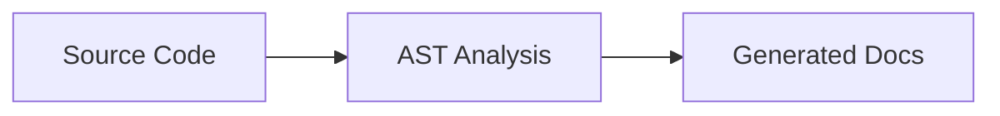
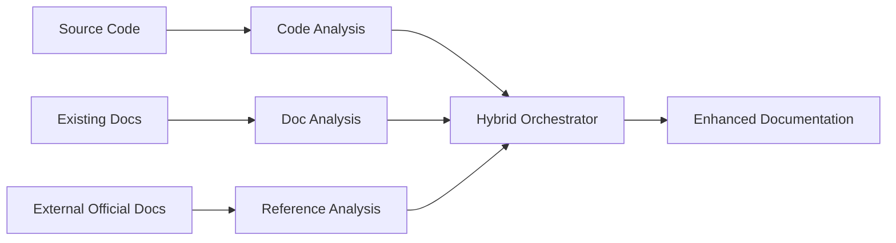

# Doxen Strategy Pivot: Documentation-Aware Enhancement

**Date:** 2026-04-01
**Status:** Proposed Strategic Direction  
**Context:** Post-pipeline consolidation strategic review

---

## 🎯 **Pivot Summary**

**FROM:** Pure code-to-documentation generation  
**TO:** Documentation-aware enhancement and orchestration

### **Current Approach (Code-Only)**

- ✅ Works for greenfield projects
- ❌ Ignores valuable existing human insights
- ❌ Recreates what already exists (poorly)

### **Proposed Approach (Documentation-Aware)**

**Value Proposition:**
- 🎯 Preserve human domain knowledge and intent
- 📊 Fill gaps where documentation is missing  
- 🔄 Update existing docs with current code state
- 🌐 Integrate external official documentation  
- 📈 Dramatically improve Tier 3 (Features/Workflows) coverage

---

## 📊 **Strategic Insights (User Analysis)**

### **1. Tier 3 Underrepresentation Problem**
**Current Data:** Tier 3 (Features/Workflows) = 12.2% of docs
**Expected Reality:** Should be 20-30% for user-facing applications  
**Root Cause:** Classification bias + library-heavy gold standard + missing external docs

**Implication:** We're **under-serving the most valuable documentation tier** for end users

### **2. Data Quality vs Raw Percentages**  
**Current Issue:** Raw file counting doesn't account for:
- Quality variation (100 low-quality vs 20 high-quality docs)
- Project type differences (libraries vs applications)
- Outliers (GitLab 2,617 files skewing results)
- Essential vs optional documentation types

**Need:** Quality-weighted, project-type-aware analysis

### **3. Missing Input: Existing Documentation**
**Current Gap:** We analyze existing docs for **strategy** but ignore them for **generation**
**Opportunity:** Most projects have valuable existing documentation that should be **enhanced, not replaced**

**Types of Existing Documentation:**
- **Internal:** README, /docs folder, inline comments, docstrings
- **External Official:** API docs, user guides, tutorials, blog posts
- **Community:** Stack Overflow, GitHub discussions, examples

---

## 🔬 **Research Questions to Explore**

### **Core Questions (User-Identified)**

#### **Q1: Reference Document Preprocessing & Weighting**
**Question:** How to preprocess existing documentation and assign weights?  
**Principle:** "Size matters, lean towards gold standard, but should not be overwhelming/dominant"

**Sub-questions:**
- What constitutes "gold standard" existing documentation?
- How to balance document size vs quality vs recency?
- How to prevent large, outdated docs from dominating small, current ones?
- What preprocessing steps preserve intent while standardizing format?

#### **Q2: Supporting Material Integration**  
**Question:** How to incorporate external official documentation?  
**Focus:** "End user oriented" official documentation as immediate improvement

**Sub-questions:**
- How to identify and validate official external documentation?
- How to prevent circular references (docs citing docs citing docs)?
- How to handle version mismatches between external docs and current code?
- What's the boundary between "official" and "community" documentation?

#### **Q3: Tier 3 Explosion Management**
**Question:** How to handle Tier 3 percentage explosion after including user-oriented docs?  
**Philosophy:** "20-30% fair for code comprehension + business logic, detailed docs exist but different detail levels"

**Sub-questions:**  
- How to distinguish "conceptual overview" vs "detailed implementation" documentation?
- What granularity level should Tier 3 target?
- How to prevent feature documentation from becoming implementation documentation?
- How to maintain hierarchy when external docs don't follow our tier system?

### **Additional Strategic Questions**

#### **Q4: Conflict Resolution**
**Question:** How to handle conflicts between existing docs and code reality?
- What when existing docs describe outdated APIs?
- How to flag vs fix vs preserve conflicting information?  
- Who is the source of truth: code, recent docs, or external official docs?

#### **Q5: Consistency Maintenance**
**Question:** How to maintain consistency across enhanced vs generated sections?
- How to ensure writing style consistency?
- How to maintain information architecture across mixed sources?
- How to prevent "Frankenstein documentation" (obvious patchwork)?

#### **Q6: Quality Validation Pipeline**  
**Question:** How to validate and score existing documentation quality?
- What metrics determine "high-quality" existing documentation?
- How to handle multilingual documentation?
- How to detect and handle generated/AI-written existing docs?
- How to score completeness, accuracy, and usefulness?

#### **Q7: Version Drift Management**
**Question:** How to handle documentation decay and code evolution?
- How to detect when existing docs are outdated?
- How often to refresh external official documentation references?
- How to handle breaking changes in external APIs/docs?

#### **Q8: Enhancement vs Generation Decision Logic**
**Question:** When to enhance existing docs vs generate from scratch?
- What quality threshold triggers "enhance" vs "replace"?
- How to handle partially good documentation (good structure, outdated content)?
- When is existing documentation too domain-specific to enhance automatically?

#### **Q9: Project Type Adaptation**
**Question:** How to adapt strategy based on project characteristics?
- Libraries vs web apps vs CLI tools vs desktop applications
- Open source vs internal/proprietary projects  
- Mature projects vs early-stage projects
- Monorepos vs single-purpose repositories

#### **Q10: Competitive Differentiation**  
**Question:** How does documentation-aware enhancement create competitive advantage?
- What existing tools attempt similar approaches?
- What's our unique value proposition vs GitHub Copilot, Mintlify, etc.?
- How to market "enhancement" vs "generation" to users?

---

## 🎯 **Proposed Investigation Approach**

### **Phase 1: Data Re-Analysis (1-2 weeks)**
1. **Re-classify existing gold standard projects** by type (library/app/CLI/etc.)
2. **Quality-weight documentation analysis** (not just file counts)  
3. **External documentation discovery** for 5-10 projects
4. **Revised tier percentages** with project-type and quality weighting

### **Phase 2: Prototype Enhancement Engine (2-3 weeks)**  
1. **ExistingDocAnalyzer agent** - Parse and score existing documentation
2. **ExternalDocIntegrator** - Identify and incorporate official external docs
3. **DocumentationOrchestrator** - Enhance vs generate decision logic
4. **Hybrid testing** on 2-3 projects with substantial existing docs

### **Phase 3: Strategy Validation (1-2 weeks)**
1. **A/B comparison:** Pure generation vs documentation-aware enhancement
2. **User feedback:** Quality, usefulness, completeness metrics
3. **Cost analysis:** Enhancement vs generation computational costs
4. **GO/NO-GO decision:** Pivot to documentation-aware as primary strategy

### **Phase 4: Production Implementation (4-6 weeks)**  
1. **Full agent integration** into existing pipeline
2. **CLI enhancement:** `./scripts/doxen enhance` workflow
3. **Quality validation pipeline** for mixed-source documentation
4. **Documentation of new approach**

---

## 🚀 **Expected Outcomes**

### **Strategic Benefits**
- **Higher quality:** Preserve human domain knowledge and intent
- **Better Tier 3 coverage:** 20-30% realistic with external doc integration  
- **Competitive differentiation:** Most tools ignore existing docs entirely
- **User adoption:** Enhancement feels less threatening than replacement

### **Technical Benefits**  
- **Reduced LLM costs:** Enhance existing content vs generate from scratch
- **Better accuracy:** Human insights + code analysis vs pure code inference
- **Faster iteration:** Update sections vs regenerate entire documents
- **Quality validation:** Cross-reference multiple sources for accuracy

### **Risk Mitigation**
- **Complexity management:** Clear decision trees for enhance vs generate
- **Quality control:** Validation pipelines for mixed-source content
- **Consistency maintenance:** Style and structure guidelines across sources
- **Version management:** Automated detection of documentation drift

---

## 🤔 **Next Steps**

1. **Strategic alignment:** Confirm this pivot direction before investigation
2. **Question prioritization:** Which research questions are highest priority?
3. **Resource allocation:** Timeline and effort estimates for investigation phases  
4. **Success criteria:** How to measure if documentation-aware approach succeeds

**This represents a fundamental evolution from "Doxen as generator" to "Doxen as documentation orchestrator and enhancer."**

---

## 📚 **References**

- **Original Strategy:** [docs/STRATEGY.md](STRATEGY.md) - Pure generation approach
- **Current Status:** [docs/PROGRESS.md](PROGRESS.md) - Tier 1-3 complete, pipeline consolidated  
- **Pipeline Documentation:** [docs/PIPELINE.md](PIPELINE.md) - Current implementation
- **Strategic Memory:** [/.claude/projects/.../memory/project_strategic_direction.md](/.claude/projects/-home-kefei-project-doxen/memory/project_strategic_direction.md) - Historical context