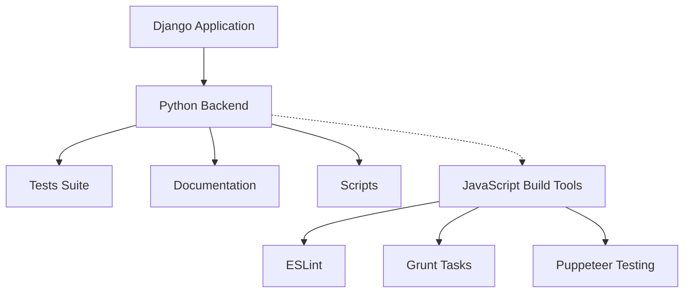

# ARCHITECTURE.md

## System Overview

This project appears to be a Django-based web application with a comprehensive Python backend and JavaScript frontend components for testing and build automation.

### Major Components
- **Django Backend**: Core application framework with 2,894 Python files
- **JavaScript Toolchain**: 113 JavaScript files handling build automation and testing
- **Testing Infrastructure**: Comprehensive test suite in `tests/` directory
- **Documentation**: Project documentation in `docs/` directory  
- **Automation Scripts**: Utility scripts in `scripts/` directory

### Technology Stack
- **Backend**: Django framework with asgiref, sqlparse, tzdata dependencies
- **Frontend Tooling**: ESLint, Grunt, Puppeteer for linting, building, and testing
- **Testing**: Python-based test suite with JavaScript end-to-end testing via Puppeteer

## Component Details

### Backend (Python)
- **Purpose**: Core Django web application providing server-side functionality
- **Key Technologies**: Django framework, asgiref for ASGI compatibility, sqlparse for SQL parsing, tzdata for timezone handling
- **Entry Points**: Django application entry point (specific configuration not detected in analysis)
- **Scale**: 2,894 Python files indicating a substantial codebase

### Frontend Build System (JavaScript)
- **Purpose**: Development toolchain for code quality, building, and testing
- **Key Technologies**: 
  - ESLint for code linting and quality enforcement
  - Grunt with grunt-cli and grunt-contrib-qunit for task automation
  - Puppeteer for browser automation and end-to-end testing
- **Entry Points**: Grunt-based build system with QUnit test integration

### Supporting Components
- **Tests**: Python-based testing infrastructure
- **Documentation**: Project documentation system
- **Scripts**: Automation and utility scripts

## Data Flow

Data flow patterns are not explicitly detected in the analysis. The Django backend likely follows standard request-response patterns, but specific routing and data handling mechanisms are not visible in the provided analysis.

**Frontend-Backend Communication**: No specific integration patterns detected between the JavaScript toolchain and Django backend.

## API Design

**API Architecture**: Not detected in analysis - no API endpoints were discovered in the codebase scan.

**Endpoint Patterns**: No endpoints identified in the analysis.

**Authentication/Authorization**: Not detected in analysis.

## Design Patterns

### Architectural Patterns
- **Django MVC Pattern**: Implied by Django framework usage, following Model-View-Controller architecture
- **Separation of Concerns**: Clear separation between Python backend logic and JavaScript build tooling

### Code Organization
- **Component-Based Structure**: 
  - `tests/` - Testing infrastructure
  - `docs/` - Documentation
  - `scripts/` - Utility scripts
- **Technology Separation**: Python and JavaScript codebases maintained separately with distinct purposes

### Notable Design Decisions
- **Comprehensive Testing Strategy**: Dual testing approach with Python tests for backend and Puppeteer for browser-based testing
- **Build Automation**: Grunt-based build system with QUnit integration for JavaScript testing
- **Django Framework**: Choice of Django suggests preference for "batteries-included" web framework approach

**Configuration**: Runtime ports and specific deployment configuration not detected in analysis.

---

*This documentation was automatically generated by [Doxen](https://github.com/kefeimo/doxen) on 2026-03-26.*

*Source: `repo` | Analysis Version: 0.1.0*
