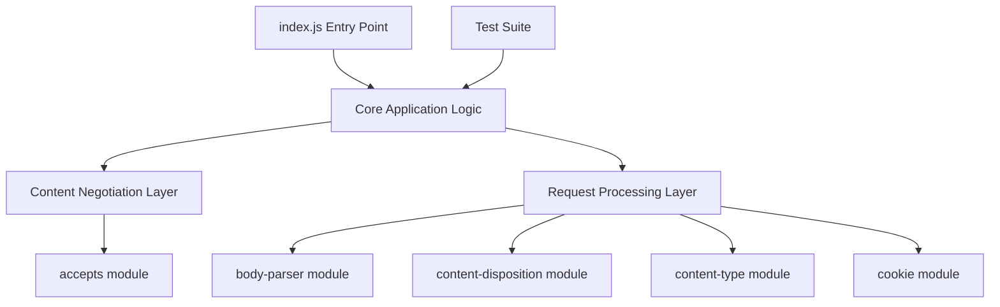
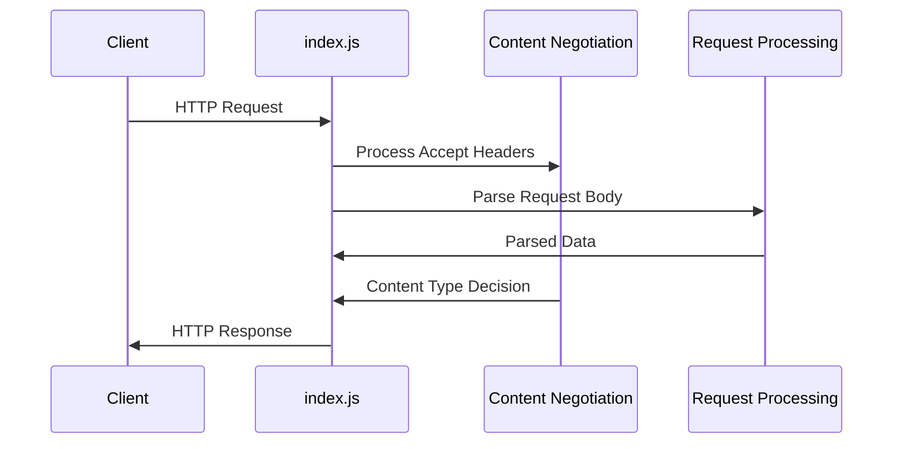

# ARCHITECTURE.md

## System Overview

This project is a JavaScript-based application with a simple architecture centered around HTTP request/response handling. The system appears to be a lightweight web framework or middleware library focused on content negotiation and request processing.

### Technology Stack
- **Runtime**: Node.js
- **Language**: JavaScript (141 files)
- **Core Dependencies**: HTTP content handling libraries
- **Testing**: JavaScript-based test suite

## Component Details

### Core Application (`index.js`)
- **Purpose**: Main entry point for the application
- **Responsibilities**: Bootstraps the application and coordinates between different processing layers
- **Key Technologies**: JavaScript, Node.js runtime

### Test Suite (`test/`)
- **Purpose**: Comprehensive testing framework for the application
- **Responsibilities**: Validates functionality across all 141 JavaScript files
- **Key Technologies**: JavaScript testing framework
- **Coverage**: Extensive test coverage given the substantial codebase size

## Data Flow

The application follows a typical request-response pattern for web applications:

1. Requests enter through the main application entry point
2. Content negotiation occurs using the `accepts` module to determine appropriate response formats
3. Request bodies are processed using `body-parser`
4. Content disposition and type are managed for proper response formatting
5. Cookie handling provides session/state management capabilities

## API Design

- **Architecture**: Not detected in analysis - no specific API endpoints identified
- **Content Handling**: RESTful patterns implied by content negotiation dependencies
- **Request Processing**: Standard HTTP request/response cycle with middleware-style processing
- **Authentication/Authorization**: Not detected in analysis

The dependency profile suggests support for:
- Multiple content types and formats
- File download/upload capabilities (content-disposition)
- Cookie-based session management
- Flexible content negotiation

## Design Patterns

### Middleware Architecture
The dependency structure suggests a middleware-based architecture pattern:
- Modular request processing through specialized libraries
- Separation of concerns between content negotiation, body parsing, and response formatting

### Library/Framework Pattern
Given the extensive codebase (141 files) with minimal external dependencies, this appears to be:
- A self-contained framework or library
- Focused on HTTP request/response processing
- Designed for reusability and modularity

### Code Organization
- **Entry Point**: Single `index.js` file for clean API surface
- **Comprehensive Testing**: Dedicated test directory indicating test-driven development
- **Dependency Management**: Minimal, focused external dependencies for core HTTP functionality

### Notable Design Decisions
- Emphasis on content negotiation and flexible response formatting
- Cookie support suggests session-aware applications
- Large codebase with focused dependencies indicates custom implementation of higher-level functionality
- No detected port configuration suggests library rather than standalone application architecture

The architecture prioritizes flexibility in content handling while maintaining a clean, testable codebase structure.

---

*This documentation was automatically generated by [Doxen](https://github.com/kefeimo/doxen) on 2026-03-26.*

*Source: `repo` | Analysis Version: 0.1.0*
