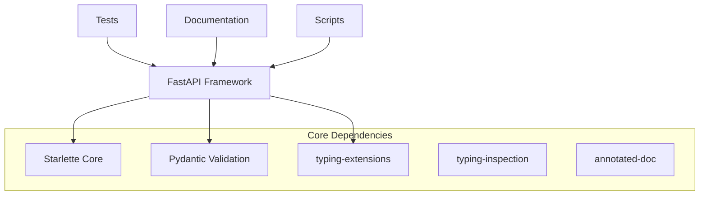
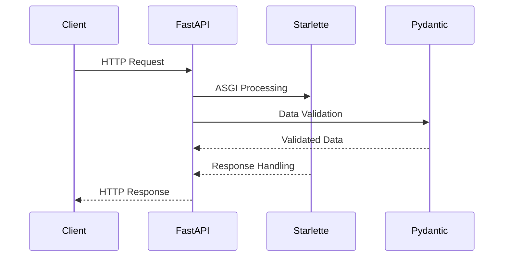

# ARCHITECTURE.md

## System Overview

This project is a **FastAPI-based Python web framework** that serves as a foundation for building modern web APIs. The system is primarily implemented in Python with minimal JavaScript components for documentation.

### Technology Stack
- **Backend Framework**: FastAPI (Python)
- **Core Dependencies**: Starlette, Pydantic, typing-extensions
- **Documentation**: JavaScript-based (4 files)
- **Testing**: Python test suite
- **Type System**: Enhanced with typing-inspection and annotated-doc

## Component Details

### FastAPI Core (`fastapi/__init__.py`)
- **Purpose**: Main framework entry point and API foundation
- **Responsibilities**: Web API framework providing high-performance async capabilities
- **Key Technologies**: Python, Starlette (ASGI framework), Pydantic (data validation)
- **Entry Point**: `fastapi/__init__.py`

### Test Suite (`tests/`)
- **Purpose**: Comprehensive testing framework for the FastAPI codebase
- **Responsibilities**: Quality assurance, regression testing, feature validation
- **Key Technologies**: Python testing frameworks
- **Scale**: Extensive test coverage across the framework

### Documentation (`docs/`)
- **Purpose**: Project documentation and guides
- **Responsibilities**: Developer documentation, API references, usage examples
- **Key Technologies**: JavaScript-based documentation system (4 files)

### Scripts (`scripts/`)
- **Purpose**: Utility scripts for development, deployment, and maintenance
- **Responsibilities**: Automation, build processes, development tooling
- **Key Technologies**: Python scripting

## Data Flow

### Request Processing
1. Incoming requests are handled through the FastAPI framework entry point
2. Starlette provides the underlying ASGI server capabilities
3. Pydantic handles request/response data validation and serialization
4. Type system enhancements ensure robust type checking and documentation

### Component Communication
- **Internal**: Components communicate through Python module imports and function calls
- **External**: No frontend-backend integrations detected in analysis
- **Data Storage**: Not detected in analysis

## API Design

### Architecture Pattern
- **Type**: ASGI-based web framework (built on Starlette)
- **Validation**: Pydantic-powered automatic request/response validation
- **Documentation**: Automatic API documentation generation via annotated-doc

### Endpoint Patterns
- **Detected Endpoints**: 0 total endpoints detected in analysis
- **Port Configuration**: Not detected in analysis
- **Authentication/Authorization**: Not detected in analysis

## Design Patterns

### Architectural Patterns
- **Framework Pattern**: FastAPI implements a modern Python web framework pattern
- **Dependency Injection**: Leverages Starlette's dependency injection capabilities
- **Type-Driven Development**: Heavy use of Python type hints with typing-extensions

### Code Organization
- **Modular Structure**: Clear separation between core framework (`fastapi/`), tests, documentation, and utilities
- **Entry Point Pattern**: Single main entry point through `fastapi/__init__.py`
- **Extensive Testing**: Large test suite (tests/) ensuring framework reliability

### Notable Design Decisions
- **ASGI Foundation**: Built on Starlette for high-performance async capabilities
- **Pydantic Integration**: Deep integration with Pydantic for automatic data validation
- **Type System Enhancement**: Uses typing-inspection and annotated-doc for advanced type introspection
- **Minimal JavaScript**: Documentation system uses JavaScript while keeping core framework purely Python

### Development Infrastructure
- **Testing Strategy**: Comprehensive Python test suite
- **Documentation**: Separate JavaScript-based documentation system
- **Automation**: Python scripts for development workflow support

---

*This documentation was automatically generated by [Doxen](https://github.com/kefeimo/doxen) on 2026-03-26.*

*Source: `repo` | Analysis Version: 0.1.0*
