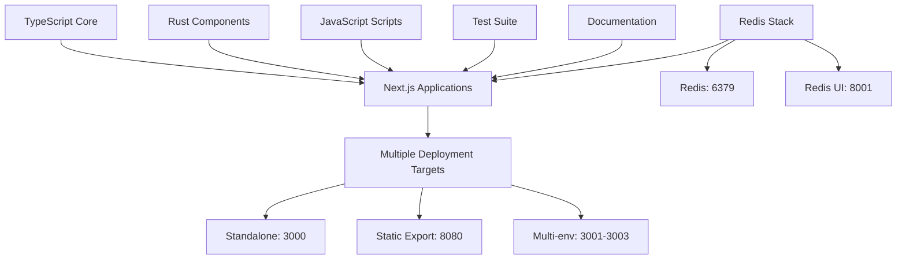

# ARCHITECTURE.md

## System Overview

This project is a multi-language monorepo primarily focused on Next.js applications with supporting infrastructure. The codebase demonstrates a polyglot architecture with TypeScript as the dominant language (5,585 files), complemented by Rust (963 files), JavaScript (241 files), and Python (1 file).

The architecture supports multiple deployment configurations including standalone applications, static exports, and multi-environment setups with Docker integration.

## Component Details

### Frontend Applications (TypeScript/JavaScript)
- **Purpose**: Multiple Next.js applications with different deployment strategies
- **Key Technologies**: Next.js, TypeScript, Babel, AST-grep
- **Deployment Variants**:
  - Standalone applications (port 3000)
  - Static export with serve (port 3000/8080)
  - Multi-environment Docker setup (ports 3001-3003)

### Rust Components
- **Purpose**: Performance-critical components and tooling (963 files indicate substantial Rust integration)
- **Integration**: Works alongside TypeScript components
- **Role**: Likely handles computationally intensive operations

### Infrastructure Components
- **Scripts Directory**: JavaScript-based automation and build scripts
- **Test Suite**: JavaScript-based testing infrastructure
- **Documentation**: Project documentation and guides

### Data Layer
- **Redis Stack**: Provides caching and data storage
  - Redis server on port 6379
  - Redis management UI on port 8001

## Data Flow

The system follows a multi-tier architecture where:

1. **Request Processing**: Multiple Next.js applications handle incoming requests on various ports
2. **Data Storage**: Redis Stack provides persistent and cached data storage
3. **Build Pipeline**: Babel and AST-grep handle code transformation and analysis
4. **Multi-Environment Support**: Docker configurations enable deployment across development (3001), staging (3002), and production (3003) environments

Frontend-backend integrations: Not detected in analysis

## API Design

API endpoints: 0 detected in analysis

The project appears to focus on frontend applications and tooling rather than traditional API services. The multiple port configurations suggest a micro-frontend or multi-application architecture rather than a monolithic API-driven system.

Authentication/authorization approach: Not detected in analysis

## Design Patterns

### Monorepo Architecture
- Multi-language codebase with clear separation of concerns
- TypeScript dominance suggests a JavaScript-first ecosystem with Rust for performance optimization

### Deployment Flexibility
- Multiple deployment strategies supported:
  - Standalone Next.js applications
  - Static site generation and export
  - Containerized multi-environment deployments

### Development Tooling
- Comprehensive build toolchain with Babel for transpilation
- AST-grep for code analysis and transformation
- Dedicated test and script directories for automation

### Configuration Management
- Environment-specific port allocation
- Docker-based multi-environment support (development, staging, production)
- Redis integration for data persistence and caching

The architecture demonstrates a modern, flexible approach to web application development with strong emphasis on deployment versatility and developer tooling. The substantial Rust component suggests performance-critical operations are handled by compiled code while maintaining JavaScript/TypeScript for application logic.

---

*This documentation was automatically generated by [Doxen](https://github.com/kefeimo/doxen) on 2026-03-26.*

*Source: `repo` | Analysis Version: 0.1.0*
