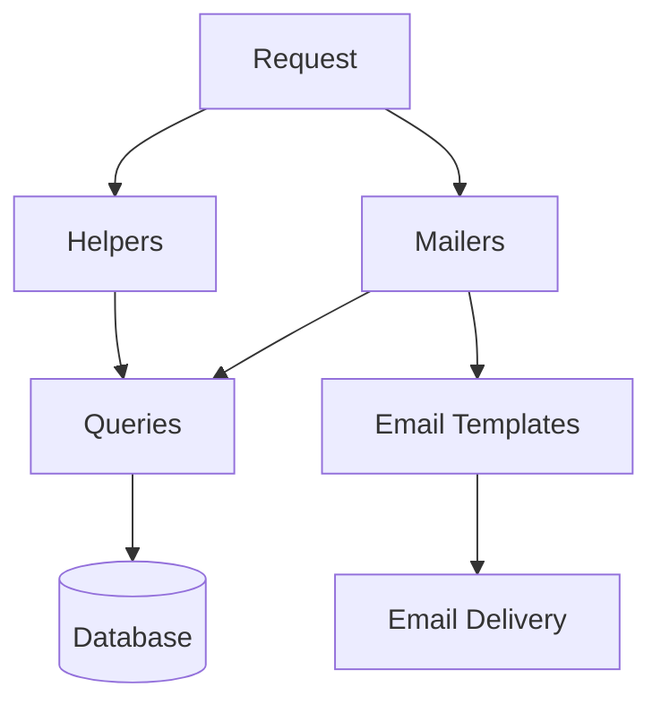

# discourse Architecture

## Overview

Discourse is a communication and notification system that handles email delivery, helper utilities, and data querying functionality. The architecture follows a modular design that separates concerns between mail delivery, reusable helper functions, and data access patterns.

The system is built on top of Django's framework, emphasizing clean separation between mail template management, delivery coordination, and supporting utilities. This architecture enables flexible email communications while maintaining maintainable and testable code.

## Component Architecture

## Core Components

### Helpers ([reference](reference_docs/REFERENCE-HELPERS.md))

**Purpose:** Provides utility functions and shared helper methods used across the system
**Dependencies:** Django core
**Used by:** Mailers, application code
**Key modules:** Configuration helpers, string formatting, data validation

### Mailers ([reference](reference_docs/REFERENCE-MAILERS.md))

**Purpose:** Handles email template management and delivery coordination
**Dependencies:** Django mail, Helpers
**Used by:** Application views, background tasks
**Key classes:** BaseMailer, TemplateMailer, BatchMailer

### Queries ([reference](reference_docs/REFERENCE-QUERIES.md))

**Purpose:** Manages data access patterns and database interactions
**Dependencies:** Django ORM
**Used by:** Mailers, Helpers
**Key functionality:** Data retrieval and persistence

## Data Flow

1. Application code initiates communication request
2. Helper utilities prepare and validate data
3. Mailer system selects appropriate template
4. Query layer retrieves necessary data
5. Mailer composes email content
6. Email delivery system sends message
7. Query layer records delivery status

## Design Patterns

- **Template Method Pattern:** Used in mailer hierarchy for customizable email generation
- **Factory Pattern:** Employed for creating mailer instances
- **Repository Pattern:** Implemented in query layer for data access abstraction
- **Observer Pattern:** Used for email delivery notifications and tracking

## Integration Points

- **Django Mail:** Core email sending functionality
- **Django Templates:** Email template rendering
- **Django ORM:** Database interactions via query layer
- **Task Queue:** Asynchronous email processing (optional)

## Getting Started

For detailed component documentation, see:
- [Helpers Reference](reference_docs/REFERENCE-HELPERS.md)
- [Mailers Reference](reference_docs/REFERENCE-MAILERS.md)
- [Queries Reference](reference_docs/REFERENCE-QUERIES.md)

For integration guides and tutorials, see:
- [guides/](guides/) - Integration patterns and tutorials
- [examples/](examples/) - Example implementations and usage patterns

The system is designed to be modular and extensible. Start by reviewing the mailer components for basic email functionality, then integrate helpers as needed for specific use cases. The query layer can be extended to support additional data access patterns.