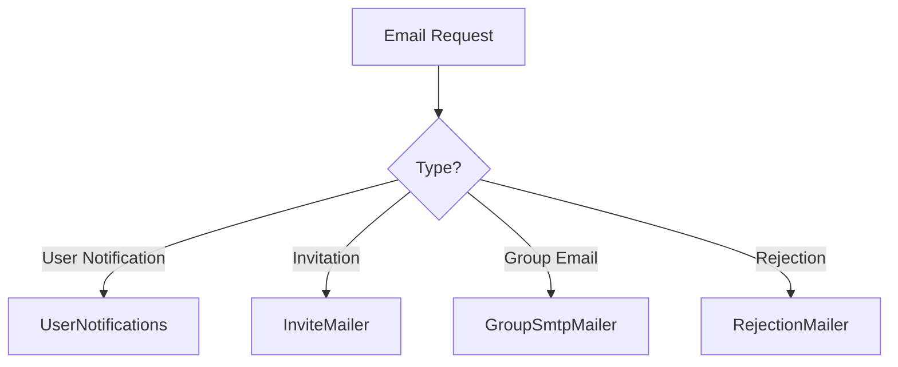

# Sending Emails in Discourse - Integration Guide

**Category:** API
**Difficulty:** Intermediate
**Prerequisites:** Basic Ruby/Rails knowledge, Discourse development environment setup, SMTP server configuration
---

## Overview

This guide covers how to send emails in Discourse using the various mailer classes. Discourse uses Rails' Action Mailer framework with custom mailers for different types of notifications and communications. We'll explore how to send user notifications, handle invites, and implement custom email workflows.

## Quick Start

Basic example of sending a user notification email

```ruby
UserNotifications.new.forgot_password(user: current_user, opts: {
  email_token: SecureRandom.hex,
  to_address: current_user.email
}).deliver_now
```

**Expected Output:**
```
Sends password reset email to user
```

---

## Core Concepts

### Mailer Architecture

Discourse uses specialized mailer classes for different email purposes:
- UserNotifications: Core user-related emails
- InviteMailer: User invitations
- GroupSmtpMailer: Group-specific emails
- RejectionMailer: Email rejection notices





---

## Step-by-Step Workflow

### Step 1: 1. Choose the appropriate mailer

**What:** Select the correct mailer class based on email type

**Why:** Different mailers handle specific email scenarios with proper templates and settings
**How:**

Discourse has specialized mailers for different purposes. Use UserNotifications for most user communications, InviteMailer for invitations, etc.

```ruby
# For user notifications
UserNotifications.new.signup(user, opts)

# For invitations
InviteMailer.new.send_invite(invite, invite_to_topic: true)
```

**Related APIs:**
- [`UserNotifications.signup`](../reference_docs/REFERENCE-MAILERS.md#signup) - Sends signup confirmation email


### Step 2: 2. Configure email options

**What:** Set up required email parameters

**Why:** Emails need proper addressing and content configuration
**How:**

Each mailer method accepts an opts hash for customization. Common options include to_address, from_alias, and custom template variables.

```ruby
opts = {
  email_token: token,
  to_address: user.email,
  from_alias: SiteSetting.email_from_alias,
  template: 'user_notifications.signup'
}
```


---

## Common Patterns

### Delayed Email Delivery

Use deliver_later for non-urgent emails to improve performance

**Use Case:** Bulk notifications and non-time-critical emails

```ruby
UserNotifications.new.digest(user, opts).deliver_later
```

**Considerations:**
- ✅ Better performance
- ✅ Background processing
- ✅ Retries on failure
- ⚠️  Not immediate
- ⚠️  Requires job queue setup
- ⚠️  More complex debugging


---

## Advanced Topics

### Custom SMTP Configuration

Configure group-specific SMTP settings for different email domains

```ruby
GroupSmtpMailer.new.send_mail(to_address, post, 
  cc_addresses: cc_list,
  bcc_addresses: bcc_list
)
```


---

## Troubleshooting

### Emails not being delivered

**Symptoms:** Emails appear sent in logs but users don't receive them

**Solution:**

Check SMTP settings and spam filtering. Verify email addresses are valid.

```ruby
# Test email delivery
TestMailer.new.send_test(to_address: 'test@example.com')
```


---

## Related Guides

- [Email Templates Guide](GUIDE-email-templates.md) - How to customize email templates and layouts

---

## API Reference

- [Mailers](../reference_docs/REFERENCE-MAILERS.md) - Complete mailer API documentation
---

**Generated:** 2026-03-27 14:06:45
**Source Project:** discourse
**Guide Type:** integration
**LLM Model:** anthropic.claude-3-5-sonnet-20241022-v2:0