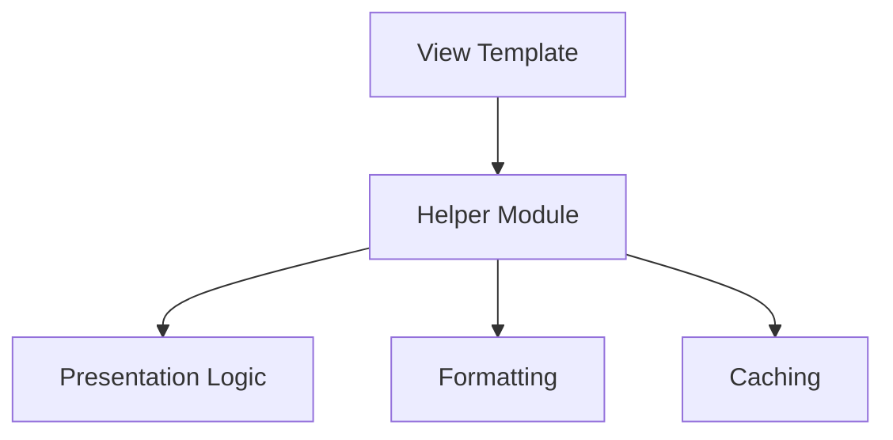

# Using View Helpers in Discourse - Integration Guide

**Category:** API
**Difficulty:** Intermediate
**Prerequisites:** Basic understanding of Ruby on Rails, Familiarity with Discourse's architecture, Understanding of Rails view templating
---

## Overview

View helpers in Discourse provide reusable presentation logic for views and templates. They encapsulate common rendering patterns, handle email formatting, manage UI components, and provide utilities for topics, posts, and user notifications. This guide covers how to effectively use and extend Discourse's helper modules to maintain consistent UI patterns and reduce code duplication.

## Quick Start

Add a simple topic title helper to your view

```ruby
<%# In your view template %>
<h1><%= render_topic_title(@topic) %></h1>
```

**Expected Output:**
```
<!-- Renders a formatted topic title with proper escaping and formatting -->
```

---

## Core Concepts

### Helper Organization

Discourse organizes helpers by functionality: PostsHelper for post-related display logic, TopicsHelper for topic rendering, UserNotificationsHelper for email notifications, etc.




### Caching Strategy

Helpers implement caching for expensive operations like URL generation and canonical links using Redis

```ruby
def cached_post_url(post, use_canonical: true)
  Rails.cache.fetch(canonical_redis_key(post)) do
    # URL generation logic
  end
end
```


---

## Step-by-Step Workflow

### Step 1: 1. Implementing Topic Display

**What:** Render topic titles and breadcrumbs in views

**Why:** Ensures consistent topic presentation and proper escaping across the application
**How:**

Use TopicsHelper methods to render topic elements with proper formatting and localization

```ruby
<%# app/views/topics/show.html.erb %>
<div class="topic-header">
  <%= render_topic_title(@topic) %>
  <%= categories_breadcrumb(@topic) %>
</div>
```

**Related APIs:**
- [`render_topic_title()`](../reference_docs/REFERENCE-HELPERS.md#render_topic_title) - Renders a formatted topic title
- [`categories_breadcrumb()`](../reference_docs/REFERENCE-HELPERS.md#categories_breadcrumb) - Generates category navigation breadcrumbs


### Step 2: 2. Email Notification Formatting

**What:** Format content for email notifications

**Why:** Ensures consistent and readable email notifications
**How:**

Use UserNotificationsHelper to format post content for emails

```ruby
def format_notification_email(post)
  content = format_for_email(post, use_excerpt: true)
  indent(content, 2)
end
```

**Related APIs:**
- [`format_for_email()`](../reference_docs/REFERENCE-HELPERS.md#format_for_email) - Formats post content for email display
- [`indent()`](../reference_docs/REFERENCE-HELPERS.md#indent) - Indents text content


---

## Common Patterns

### URL Caching

Cache generated URLs to improve performance

**Use Case:** When generating many post URLs in list views

```ruby
def get_post_url(post)
  cached_post_url(post, use_canonical: true)
end
```

**Considerations:**
- ✅ Improves performance for repeated URL generation
- ✅ Consistent URL formatting
- ✅ Reduces database queries
- ⚠️  Requires cache invalidation management
- ⚠️  Additional memory usage for cache storage
- ⚠️  Potential stale data if not properly managed


---

## Advanced Topics

### Custom Helper Extension

Create custom helpers that integrate with Discourse's existing helper ecosystem

```ruby
module CustomTopicHelper
  def custom_topic_format(topic)
    render_topic_title(topic) + additional_formatting
  end
end
```


---

## Troubleshooting

### Cached URLs Not Updating

**Symptoms:** Post URLs remain outdated after content changes

**Solution:**

Clear the URL cache using PostsHelper.clear_canonical_cache!

```ruby
PostsHelper.clear_canonical_cache!(post)
```


---

## Related Guides

- [Topic Rendering Guide](GUIDE-topic-rendering.md) - Detailed guide on topic display and formatting

---

## API Reference

- [Helpers](../reference_docs/REFERENCE-HELPERS.md) - Complete API reference for Discourse helpers
---

**Generated:** 2026-03-27 14:04:52
**Source Project:** discourse
**Guide Type:** integration
**LLM Model:** anthropic.claude-3-5-sonnet-20241022-v2:0