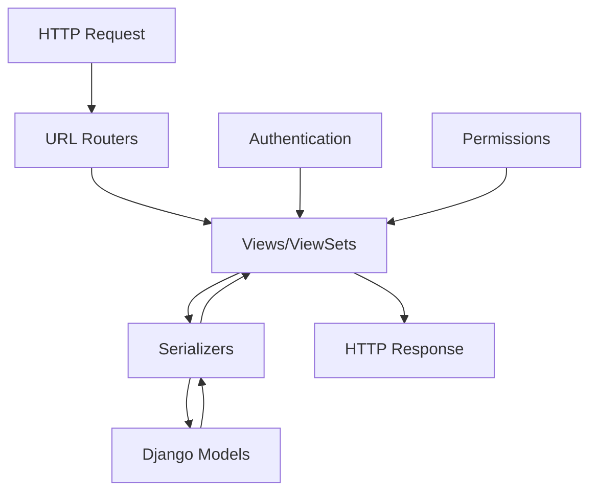

# django-rest-framework Architecture

## Overview

Django REST framework (DRF) is a powerful toolkit for building Web APIs on top of Django. It provides a set of reusable components that work together to transform Django models into RESTful APIs with features like serialization, authentication, permissions, and viewsets.

The framework follows a layered architecture pattern where each component has a specific responsibility in the request-response cycle. This separation of concerns allows developers to customize individual components while maintaining a consistent API interface.

## Component Architecture

## Core Components

### Views ([reference](reference_docs/REFERENCE-VIEWS.md))
**Purpose:** Handles HTTP requests and defines API behavior
**Dependencies:** Serializers, Authentication, Permissions
**Used by:** URL Routers
**Key classes:** ViewSet, APIView

### Serializers ([reference](reference_docs/REFERENCE-SERIALIZERS.md))
**Purpose:** Converts complex data types to/from Python native datatypes
**Dependencies:** Django Models
**Used by:** Views
**Key classes:** ModelSerializer, Serializer

### Authentication ([reference](reference_docs/REFERENCE-AUTHENTICATION.md))
**Purpose:** Identifies and validates API users
**Dependencies:** Django auth system
**Used by:** Views
**Key classes:** TokenAuthentication, SessionAuthentication

### Permissions ([reference](reference_docs/REFERENCE-PERMISSIONS.md))
**Purpose:** Controls access to API endpoints
**Dependencies:** Authentication
**Used by:** Views
**Key classes:** IsAuthenticated, DjangoModelPermissions

### Routers ([reference](reference_docs/REFERENCE-ROUTERS.md))
**Purpose:** Provides URL routing for ViewSets
**Dependencies:** Views
**Used by:** Django URLconf
**Key classes:** DefaultRouter, SimpleRouter

## Data Flow

1. HTTP request arrives at a URL endpoint
2. Router maps URL to appropriate ViewSet/View
3. Authentication identifies the requesting user
4. Permission checks determine if user can access endpoint
5. View processes request and delegates to Serializer
6. Serializer validates incoming data (for writes)
7. View performs business logic and model operations
8. Serializer formats data for response
9. View returns formatted HTTP response

## Design Patterns

- **Model-View-Serializer:** Adaptation of MVC for API development
- **Component-Based Architecture:** Modular, swappable components
- **Chain of Responsibility:** Authentication and permission checks
- **Strategy Pattern:** Pluggable serialization and authentication backends
- **Factory Pattern:** ViewSet and Serializer creation

## Integration Points

- **Django Models:** Data layer integration
- **Django Auth:** User authentication system
- **Django URLs:** URL routing and configuration
- **Content Negotiation:** Multiple format support (JSON, XML)
- **HTTP Protocol:** RESTful interface standards

## Getting Started

For detailed component documentation, see:
- [Authentication Reference](reference_docs/REFERENCE-AUTHENTICATION.md)
- [Permissions Reference](reference_docs/REFERENCE-PERMISSIONS.md)
- [Routers Reference](reference_docs/REFERENCE-ROUTERS.md)
- [Serializers Reference](reference_docs/REFERENCE-SERIALIZERS.md)
- [Views Reference](reference_docs/REFERENCE-VIEWS.md)

For integration guides and tutorials, see:
- [guides/](guides/) - Complete collection of tutorials and integration patterns
- [TUTORIAL-quickstart.md](guides/TUTORIAL-quickstart.md) - Build your first API
- [TUTORIAL-serialization.md](guides/TUTORIAL-serialization.md) - Learn serialization
- [GUIDE-authentication.md](guides/GUIDE-authentication.md) - Authentication patterns
- [GUIDE-serialization.md](guides/GUIDE-serialization.md) - Advanced serialization