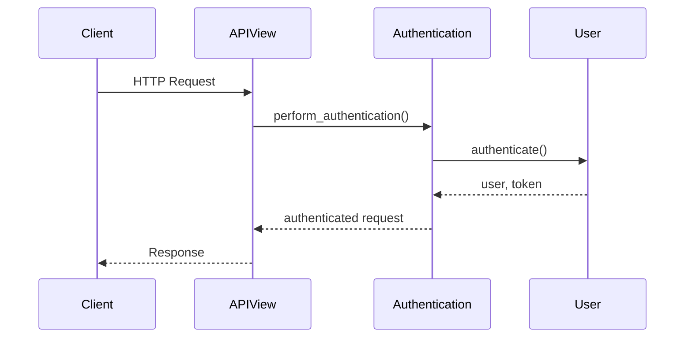

# Authentication Integration Guide for Django REST Framework - Integration Guide

**Category:** Authentication
**Difficulty:** Intermediate
**Prerequisites:** Django REST Framework installed, Basic understanding of Django views and models, Django project setup with database configured
---

## Overview

This guide covers implementing authentication in Django REST Framework (DRF) APIs. You'll learn how to secure your API endpoints using various authentication schemes including session-based, token-based, and basic authentication. We'll explore how to combine authentication with permissions and handle common authentication scenarios.

## Quick Start

Basic token authentication setup for a REST API endpoint

```python
from rest_framework.authentication import TokenAuthentication
from rest_framework.permissions import IsAuthenticated

class MyAPIView(APIView):
    authentication_classes = [TokenAuthentication]
    permission_classes = [IsAuthenticated]
    
    def get(self, request):
        return Response({'data': 'Protected resource'})
```

**Expected Output:**
```
HTTP 401 UNAUTHORIZED
{'detail': 'Authentication credentials were not provided.'}
```

---

## Core Concepts

### Authentication Flow

DRF authentication occurs before view execution. When a request arrives, DRF attempts authentication using each scheme in authentication_classes until one succeeds or all fail.




### Authentication Schemes

DRF provides several built-in authentication schemes: SessionAuthentication, TokenAuthentication, and BasicAuthentication. Each has different security characteristics and use cases.

```python
from rest_framework.authentication import (
    SessionAuthentication,
    BasicAuthentication,
    TokenAuthentication
)
```


---

## Step-by-Step Workflow

### Step 1: Configure Authentication Classes

**What:** Set up authentication schemes for your API views

**Why:** Define how clients should authenticate requests to your API endpoints
**How:**

Choose and configure authentication classes either globally or per-view. Global settings affect all views while per-view settings override global ones.

```python
# settings.py
REST_FRAMEWORK = {
    'DEFAULT_AUTHENTICATION_CLASSES': [
        'rest_framework.authentication.TokenAuthentication',
        'rest_framework.authentication.SessionAuthentication',
    ]
}

# views.py
class MyAPIView(APIView):
    authentication_classes = [TokenAuthentication]
    permission_classes = [IsAuthenticated]
```

**Related APIs:**
- [`TokenAuthentication`](../reference_docs/REFERENCE-AUTHENTICATION.md#tokenauthentication) - Token-based authentication scheme


### Step 2: Implement Authentication Logic

**What:** Add authentication checking to views

**Why:** Ensure only authenticated users can access protected resources
**How:**

DRF views handle authentication through the perform_authentication() method which runs before view execution

```python
from rest_framework.views import APIView

class ProtectedView(APIView):
    def perform_authentication(self, request):
        super().perform_authentication(request)
        if not request.user.is_authenticated:
            raise AuthenticationFailed('Not authenticated')
```

**Related APIs:**
- [`APIView.perform_authentication`](../reference_docs/REFERENCE-VIEWS.md#perform_authentication) - Performs authentication on the incoming request


---

## Common Patterns

### Multiple Authentication Schemes

Support multiple authentication methods for flexibility

**Use Case:** When your API needs to handle both session-based web clients and token-based mobile clients

```python
class MultiAuthView(APIView):
    authentication_classes = [
        SessionAuthentication,
        TokenAuthentication
    ]
```

**Considerations:**
- ✅ Flexible for different client types
- ✅ Fallback authentication options
- ✅ Smooth transition when adding new auth schemes
- ⚠️  Slightly more complex configuration
- ⚠️  Need to handle different auth types in error handling
- ⚠️  Must consider security implications of each scheme


---

## Advanced Topics

### Custom Authentication

Create custom authentication schemes by subclassing BaseAuthentication

```python
from rest_framework.authentication import BaseAuthentication

class CustomAuth(BaseAuthentication):
    def authenticate(self, request):
        token = request.META.get('HTTP_X_CUSTOM_TOKEN')
        if not token:
            return None
        try:
            user = get_user_from_token(token)
            return (user, None)
        except User.DoesNotExist:
            raise AuthenticationFailed('Invalid token')
```


---

## Troubleshooting

### Token Authentication Failed

**Symptoms:** Receiving 401 Unauthorized responses despite valid token

**Solution:**

Check token format and header. Token should be included in Authorization header as 'Token <token_key>'

```python
# Python requests example
headers = {
    'Authorization': f'Token {token_key}'
}
response = requests.get(url, headers=headers)
```


---

## Related Guides

- [Permissions Guide](permissions.md) - Implementing permissions with authentication

---

## API Reference

- [Authentication](../reference_docs/REFERENCE-AUTHENTICATION.md) - Authentication classes and utilities- [Views](../reference_docs/REFERENCE-VIEWS.md) - View authentication handling
---

**Generated:** 2026-03-27 13:52:32
**Source Project:** django-rest-framework
**Guide Type:** integration
**LLM Model:** anthropic.claude-3-5-sonnet-20241022-v2:0