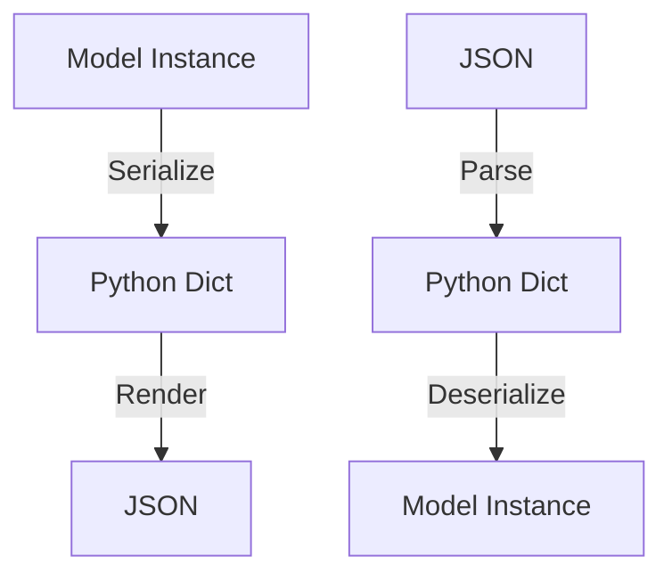

# Getting Started with Django REST Framework - Integration Guide

**Category:** API
**Difficulty:** Beginner
**Prerequisites:** Python 3.6+, Django 3.0+
---

## Overview

This guide shows you how to create your first API using Django REST Framework (DRF). You'll learn how to serialize data models, create API views, and set up URL routing. By the end, you'll have a working REST API with proper request handling, serialization, and URL endpoints.

## Quick Start

Create a basic API endpoint with model serialization

```python
# models.py
from django.db import models

class Book(models.Model):
    title = models.CharField(max_length=100)
    author = models.CharField(max_length=100)
    
# serializers.py
from rest_framework import serializers

class BookSerializer(serializers.ModelSerializer):
    class Meta:
        model = Book
        fields = ['id', 'title', 'author']
        
# views.py
from rest_framework.views import APIView
from rest_framework.response import Response

class BookList(APIView):
    def get(self, request):
        books = Book.objects.all()
        serializer = BookSerializer(books, many=True)
        return Response(serializer.data)
```

**Expected Output:**
```
[
  {
    "id": 1,
    "title": "Django for Beginners",
    "author": "William Vincent"
  }
]
```

---

## Core Concepts

### Serialization

Serializers convert complex data like querysets and model instances into Python datatypes that can be rendered into JSON/XML. They also handle deserialization - parsing incoming data back into complex types.

```python
class BookSerializer(serializers.ModelSerializer):
    class Meta:
        model = Book
        fields = ['id', 'title', 'author']
        read_only_fields = ['id']
```




---

## Step-by-Step Workflow

### Step 1: Create Model Serializer

**What:** Define how your model data should be converted to/from JSON

**Why:** Serializers handle data validation and conversion between Python objects and API formats
**How:**

Create a serializer class that inherits from ModelSerializer and specifies the model and fields to include

```python
from rest_framework import serializers
from .models import Book

class BookSerializer(serializers.ModelSerializer):
    class Meta:
        model = Book
        fields = ['id', 'title', 'author']
```

**Related APIs:**
- [`ModelSerializer`](../reference_docs/REFERENCE-SERIALIZERS.md#modelserializer) - Base class for model serializers


### Step 2: Create API View

**What:** Define the API endpoint logic and HTTP method handlers

**Why:** Views handle requests/responses and contain the business logic for your API endpoints
**How:**

Create a view class inheriting from APIView to handle HTTP methods

```python
from rest_framework.views import APIView
from rest_framework.response import Response

class BookList(APIView):
    def get(self, request):
        books = Book.objects.all()
        serializer = BookSerializer(books, many=True)
        return Response(serializer.data)
        
    def post(self, request):
        serializer = BookSerializer(data=request.data)
        if serializer.is_valid():
            serializer.save()
            return Response(serializer.data, status=201)
        return Response(serializer.errors, status=400)
```

**Related APIs:**
- [`APIView`](../reference_docs/REFERENCE-VIEWS.md#apiview) - Base class for API views


### Step 3: Configure URL Routing

**What:** Map URLs to your API views

**Why:** Routes determine which view handles which URL pattern
**How:**

Use DRF routers to automatically generate URL patterns for your views

```python
from rest_framework.routers import DefaultRouter
from .views import BookViewSet

router = DefaultRouter()
router.register('books', BookViewSet)

urlpatterns = [
    path('api/', include(router.urls))
]
```

**Related APIs:**
- [`DefaultRouter`](../reference_docs/REFERENCE-ROUTERS.md#defaultrouter) - Router class that handles URL generation


---

## Common Patterns

### ViewSet Pattern

ViewSets combine common CRUD operations into a single class

**Use Case:** When you need standard list/create/retrieve/update/delete endpoints

```python
from rest_framework import viewsets

class BookViewSet(viewsets.ModelViewSet):
    queryset = Book.objects.all()
    serializer_class = BookSerializer
```

**Considerations:**
- ✅ Less code duplication
- ✅ Consistent URL patterns
- ✅ Automatic routing
- ⚠️  Less flexibility than individual views
- ⚠️  May include unnecessary actions
- ⚠️  Harder to customize individual endpoints


---

## Advanced Topics

### Nested Serialization

Handle related models and nested data structures

```python
class AuthorSerializer(serializers.ModelSerializer):
    books = BookSerializer(many=True, read_only=True)
    
    class Meta:
        model = Author
        fields = ['id', 'name', 'books']
```


---

## Troubleshooting

### Serializer validation errors

**Symptoms:** 400 Bad Request responses with validation error messages

**Solution:**

Check the incoming data matches your serializer fields and validation rules

```python
# Add validation to serializer
class BookSerializer(serializers.ModelSerializer):
    def validate_title(self, value):
        if len(value) < 3:
            raise serializers.ValidationError('Title must be at least 3 characters')
        return value
```


---

## Related Guides

- [Authentication & Permissions](authentication.md) - Learn how to secure your API endpoints

---

## API Reference

- [Serializers](../reference_docs/REFERENCE-SERIALIZERS.md) - API reference for serialization- [Views](../reference_docs/REFERENCE-VIEWS.md) - API reference for views- [Routers](../reference_docs/REFERENCE-ROUTERS.md) - API reference for URL routing
---

**Generated:** 2026-03-27 13:52:08
**Source Project:** django-rest-framework
**Guide Type:** integration
**LLM Model:** anthropic.claude-3-5-sonnet-20241022-v2:0