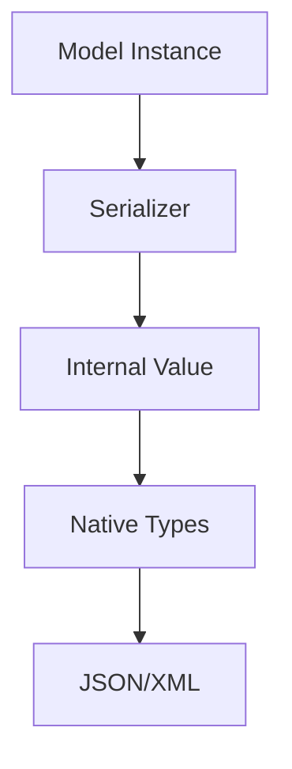

# Working with Django REST Framework Serializers - Integration Guide

**Category:** Data
**Difficulty:** Intermediate
**Prerequisites:** Django project setup, Basic understanding of Django models, Python knowledge
---

## Overview

Serializers allow you to convert complex Django model instances and querysets into native Python datatypes that can be easily rendered into JSON/XML. They also handle deserialization - allowing parsed data to be converted back into complex types after validating the incoming data. This guide covers how to effectively use serializers for data transformation, validation, and complex nested relationships.

## Quick Start

Basic model serializer setup

```python
from rest_framework import serializers

class UserSerializer(serializers.ModelSerializer):
    class Meta:
        model = User
        fields = ['id', 'username', 'email']

# Usage
user = User.objects.get(id=1)
serializer = UserSerializer(user)
serializer.data  # {'id': 1, 'username': 'admin', 'email': 'admin@example.com'}
```

**Expected Output:**
```
{'id': 1, 'username': 'admin', 'email': 'admin@example.com'}
```

---

## Core Concepts

### Serialization Flow

The serialization process converts Django models to native Python types through several steps: model instance → serializer → internal value → primitive types → JSON




### Validation Pipeline

Serializers validate data through field-level validation, object-level validation, and custom validators before allowing create/update operations

```python
def validate(self, data):
    if data['start'] > data['end']:
        raise serializers.ValidationError('End must be after start')
    return data
```


---

## Step-by-Step Workflow

### Step 1: Define Model Serializer

**What:** Create a serializer class that maps to your Django model

**Why:** To specify which model fields should be serialized and how they should be transformed
**How:**

Subclass ModelSerializer and define Meta class with model and fields attributes

```python
class ProfileSerializer(serializers.ModelSerializer):
    class Meta:
        model = Profile
        fields = ['id', 'user', 'bio', 'location']
        read_only_fields = ['user']
```

**Related APIs:**
- [`ModelSerializer`](../reference_docs/REFERENCE-SERIALIZERS.md#modelserializer) - Base class for model-based serializers


### Step 2: Handle Nested Relationships

**What:** Configure serialization of related models

**Why:** To include related data in API responses and handle nested writes
**How:**

Use nested serializers for related fields and specify depth for automatic nested serialization

```python
class UserProfileSerializer(serializers.ModelSerializer):
    profile = ProfileSerializer()
    
    class Meta:
        model = User
        fields = ['id', 'username', 'profile']
        depth = 1
```

**Related APIs:**
- [`build_nested_field`](../reference_docs/REFERENCE-SERIALIZERS.md#build_nested_field) - Creates nested fields for relationships


---

## Common Patterns

### Custom Field Serialization

Override to_representation/to_internal_value for custom field handling

**Use Case:** When you need special formatting or parsing of field values

```python
def to_representation(self, instance):
    data = super().to_representation(instance)
    data['full_name'] = f'{instance.first_name} {instance.last_name}'
    return data
```

**Considerations:**
- ✅ Complete control over serialization
- ✅ Can add computed fields
- ✅ Handles complex transformations
- ⚠️  More code to maintain
- ⚠️  May impact performance
- ⚠️  Need to handle edge cases


---

## Advanced Topics

### Custom Validation Logic

Implementing field-level, object-level and custom validators

```python
from rest_framework import serializers

class EventSerializer(serializers.ModelSerializer):
    def validate_date(self, value):
        if value < datetime.date.today():
            raise serializers.ValidationError('Date cannot be in past')
        return value

    def validate(self, data):
        if data['end_time'] <= data['start_time']:
            raise serializers.ValidationError('End time must be after start time')
        return data
```


---

## Troubleshooting

### Nested Serializer Write Operations Failing

**Symptoms:** ValidationError when trying to create/update nested objects

**Solution:**

Override create()/update() methods to handle nested relationships explicitly

```python
def create(self, validated_data):
    profile_data = validated_data.pop('profile')
    user = User.objects.create(**validated_data)
    Profile.objects.create(user=user, **profile_data)
    return user
```


---

## Related Guides

- [ViewSet Integration](GUIDE-viewsets.md) - Using serializers with ViewSets

---

## API Reference

- [Serializers](../reference_docs/REFERENCE-SERIALIZERS.md) - Complete serializer API reference
---

**Generated:** 2026-03-27 13:53:00
**Source Project:** django-rest-framework
**Guide Type:** integration
**LLM Model:** anthropic.claude-3-5-sonnet-20241022-v2:0